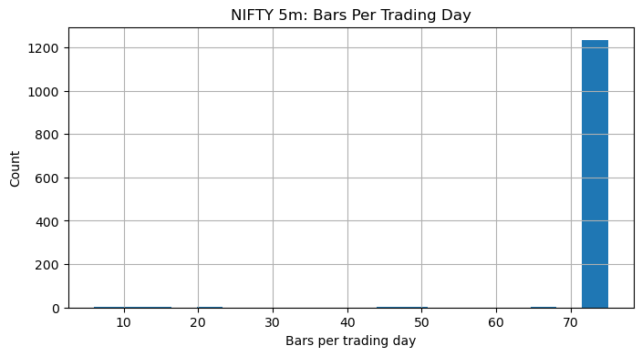

# Phase 1 Data Quality Report

**Generated:** 2026-06-10 21:28

## Dataset Overview
| TF | Rows | Date range |
|---|---|---|
| 5m | 92,682 | 2020-11-09 → 2025-11-07 |
| 15m | 30,900 | 2020-11-09 → 2025-11-07 |
| 1h | 7,425 | 2020-11-09 → 2025-11-07 |
| 1d | 1,244 | 2020-11-09 → 2025-11-07 |

## Data Quality
- Intra-session gaps (sessions with missing 5m bars): **5**
  - Sample affected dates: 2021-08-07, 2022-01-27, 2022-04-09, 2024-03-02, 2024-05-18

## Bars Per Day Distribution
- Mean: 74.5 | Min: 6 | Max: 75

## Spot-Check: First Trading Day at Each TF
| TF | timestamp | bar_close | open | high | low | close |
|---|---|---|---|---|---|---|
| 5m | 2020-11-09 09:15:00+05:30 | 2020-11-09 09:20:00+05:30 | 12389.00 | 12430.80 | 12383.90 | 12410.10 |
| 15m | 2020-11-09 09:15:00+05:30 | 2020-11-09 09:30:00+05:30 | 12389.00 | 12447.70 | 12383.90 | 12447.20 |
| 1h | 2020-11-09 09:15:00+05:30 | 2020-11-09 10:15:00+05:30 | 12389.00 | 12451.80 | 12383.90 | 12433.80 |
| 1d | 2020-11-09 09:15:00+05:30 | 2020-11-09 15:30:00+05:30 | 12389.00 | 12474.00 | 12367.30 | 12468.60 |