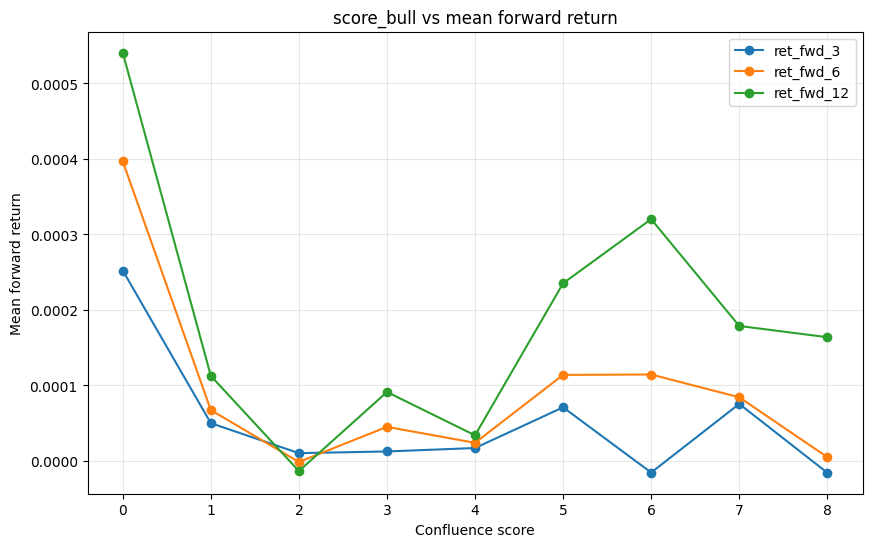
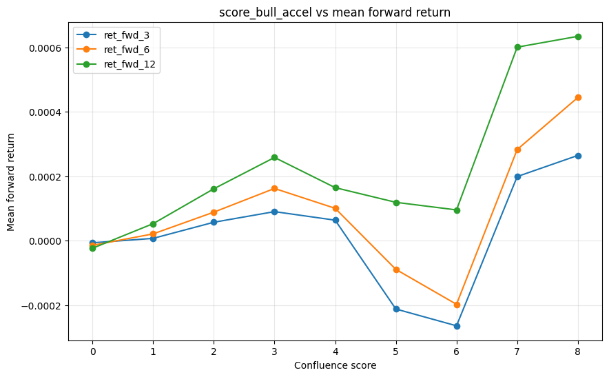

# Phase 4 — Inter-Timeframe Pattern Analysis

## L4 Caveat — Effective Sample Size

Higher-TF (1h, 1d) feature values are repeated across every 5m bar within that higher-TF bar (e.g. one 1h bar's state appears in ~12 consecutive 5m rows; one 1d bar's state appears in ~75 5m rows). Throughout this report, `n_5m` is the raw 5m row count and `n_htf` is the count of **unique** higher-TF bars -- the effective sample size for any HTF-conditional statistic. A cell with `n_5m=1000` but `n_htf=15` should be interpreted with the caution warranted by 15 independent observations, not 1000.

## 4A — Higher-TF Regime Filter (H11)

Tests **H11**: do 5m setups perform better when the higher-TF regime (1h/1d `A_state`/`B_state`) is aligned vs. counter-aligned? Each table below shows `ret_fwd_12` statistics for the 5m setup, stratified by the higher-TF state at the time of the setup. `n_htf` is the **effective sample size** (unique higher-TF bars) per the L4 caveat above -- always <= n_5m, often dramatically so for 1d. Full tables for all horizons {3,6,12} are saved under `reports/phase4/4a_*.csv`.

### Setup: 5m `A_state == bull_accel` (H1 core setup)

**Stratified by 1h_A_state** (ret_fwd_12):

| group         |         n_5m |       n_htf |   mean_ret |   hit_rate |    t_stat |   p_val_raw |
|:--------------|-------------:|------------:|-----------:|-----------:|----------:|------------:|
| bull_accel    |  3650.000000 |  966.000000 |   0.000349 |   0.587397 |  2.521975 |    0.011670 |
| bull_decel    |  5469.000000 | 1253.000000 |   0.000169 |   0.517462 |  1.675356 |    0.093864 |
| bear_decel    |  5046.000000 | 1237.000000 |   0.000006 |   0.498216 |  0.045394 |    0.963793 |
| bear_accel    |  8436.000000 | 1692.000000 |  -0.000028 |   0.500593 | -0.338239 |    0.735183 |
| unconditional | 23370.000000 | 5148.000000 |   0.000112 |   0.521438 |  2.021746 |    0.043203 |

**Stratified by 1h_B_state** (ret_fwd_12):

| group         |         n_5m |       n_htf |   mean_ret |   hit_rate |    t_stat |   p_val_raw |
|:--------------|-------------:|------------:|-----------:|-----------:|----------:|------------:|
| bull_accel    |  3578.000000 |  811.000000 |  -0.000002 |   0.521800 | -0.011979 |    0.990442 |
| bull_decel    |  6967.000000 | 1599.000000 |   0.000235 |   0.535955 |  2.710854 |    0.006711 |
| bear_decel    |  2972.000000 |  672.000000 |   0.000021 |   0.525236 |  0.120488 |    0.904097 |
| bear_accel    |  9084.000000 | 2066.000000 |   0.000033 |   0.500771 |  0.378684 |    0.704922 |
| unconditional | 23370.000000 | 5148.000000 |   0.000112 |   0.521438 |  2.021746 |    0.043203 |

**Stratified by 1d_A_state** (ret_fwd_12):

| group         |         n_5m |      n_htf |   mean_ret |   hit_rate |    t_stat |   p_val_raw |
|:--------------|-------------:|-----------:|-----------:|-----------:|----------:|------------:|
| bull_accel    |  4630.000000 | 258.000000 |   0.000280 |   0.530022 |  2.997519 |    0.002722 |
| bull_decel    |  4212.000000 | 211.000000 |  -0.000178 |   0.498813 | -1.154362 |    0.248352 |
| bear_decel    |  4350.000000 | 236.000000 |   0.000055 |   0.512874 |  0.570023 |    0.568662 |
| bear_accel    |  5200.000000 | 266.000000 |   0.000182 |   0.526154 |  1.599734 |    0.109658 |
| unconditional | 23370.000000 | 971.000000 |   0.000112 |   0.521438 |  2.021746 |    0.043203 |

**Stratified by 1d_B_state** (ret_fwd_12):

| group         |         n_5m |      n_htf |   mean_ret |   hit_rate |   t_stat |   p_val_raw |
|:--------------|-------------:|-----------:|-----------:|-----------:|---------:|------------:|
| bull_accel    |  3173.000000 | 169.000000 |   0.000117 |   0.543334 | 1.056423 |    0.290775 |
| bull_decel    |  5161.000000 | 277.000000 |   0.000043 |   0.507072 | 0.435692 |    0.663060 |
| bear_decel    |  3069.000000 | 163.000000 |   0.000002 |   0.503095 | 0.014699 |    0.988272 |
| bear_accel    |  6989.000000 | 362.000000 |   0.000162 |   0.520389 | 1.486531 |    0.137139 |
| unconditional | 23370.000000 | 971.000000 |   0.000112 |   0.521438 | 2.021746 |    0.043203 |

### Setup: 5m `A_state == bear_accel` (most robust A-state finding in Phase 3)

**Stratified by 1h_A_state** (ret_fwd_12):

| group         |         n_5m |       n_htf |   mean_ret |   hit_rate |   t_stat |   p_val_raw |
|:--------------|-------------:|------------:|-----------:|-----------:|---------:|------------:|
| bull_accel    |  7814.000000 | 1549.000000 |   0.000245 |   0.566931 | 2.432567 |    0.014992 |
| bull_decel    |  5514.000000 | 1298.000000 |   0.000025 |   0.530287 | 0.229982 |    0.818106 |
| bear_decel    |  5855.000000 | 1281.000000 |   0.000120 |   0.522312 | 1.141092 |    0.253832 |
| bear_accel    |  4670.000000 | 1248.000000 |   0.000051 |   0.512848 | 0.463035 |    0.643339 |
| unconditional | 24688.000000 | 5376.000000 |   0.000138 |   0.539705 | 2.534961 |    0.011246 |

**Stratified by 1h_B_state** (ret_fwd_12):

| group         |         n_5m |       n_htf |   mean_ret |   hit_rate |    t_stat |   p_val_raw |
|:--------------|-------------:|------------:|-----------:|-----------:|----------:|------------:|
| bull_accel    |  4235.000000 |  935.000000 |   0.000220 |   0.563872 |  1.680880 |    0.092786 |
| bull_decel    |  7321.000000 | 1658.000000 |   0.000137 |   0.529299 |  1.629011 |    0.103311 |
| bear_decel    |  3592.000000 |  781.000000 |   0.000325 |   0.550947 |  1.955124 |    0.050568 |
| bear_accel    |  8705.000000 | 2002.000000 |  -0.000012 |   0.524428 | -0.126553 |    0.899294 |
| unconditional | 24688.000000 | 5376.000000 |   0.000138 |   0.539705 |  2.534961 |    0.011246 |

**Stratified by 1d_A_state** (ret_fwd_12):

| group         |         n_5m |      n_htf |   mean_ret |   hit_rate |    t_stat |   p_val_raw |
|:--------------|-------------:|-----------:|-----------:|-----------:|----------:|------------:|
| bull_accel    |  5451.000000 | 258.000000 |   0.000287 |   0.574023 |  3.587849 |    0.000333 |
| bull_decel    |  4030.000000 | 212.000000 |  -0.000027 |   0.510670 | -0.166023 |    0.868139 |
| bear_decel    |  4791.000000 | 236.000000 |  -0.000057 |   0.517429 | -0.478135 |    0.632554 |
| bear_accel    |  5090.000000 | 265.000000 |   0.000137 |   0.528127 |  1.201824 |    0.229432 |
| unconditional | 24688.000000 | 971.000000 |   0.000138 |   0.539705 |  2.534961 |    0.011246 |

**Stratified by 1d_B_state** (ret_fwd_12):

| group         |         n_5m |      n_htf |   mean_ret |   hit_rate |    t_stat |   p_val_raw |
|:--------------|-------------:|-----------:|-----------:|-----------:|----------:|------------:|
| bull_accel    |  3357.000000 | 170.000000 |   0.000084 |   0.521895 |  0.733483 |    0.463264 |
| bull_decel    |  5649.000000 | 276.000000 |   0.000161 |   0.543328 |  1.846875 |    0.064765 |
| bear_decel    |  3324.000000 | 164.000000 |  -0.000096 |   0.530084 | -0.749535 |    0.453535 |
| bear_accel    |  7032.000000 | 361.000000 |   0.000145 |   0.536263 |  1.180282 |    0.237888 |
| unconditional | 24688.000000 | 971.000000 |   0.000138 |   0.539705 |  2.534961 |    0.011246 |

### Setup: 5m `B_state == bull_accel` (H5 core setup)

**Stratified by 1h_A_state** (ret_fwd_12):

| group         |         n_5m |       n_htf |   mean_ret |   hit_rate |    t_stat |   p_val_raw |
|:--------------|-------------:|------------:|-----------:|-----------:|----------:|------------:|
| bull_accel    |  3749.000000 |  990.000000 |   0.000260 |   0.574286 |  1.855771 |    0.063486 |
| bull_decel    |  2511.000000 |  669.000000 |   0.000345 |   0.551573 |  2.134217 |    0.032825 |
| bear_decel    |  2869.000000 |  793.000000 |  -0.000095 |   0.487626 | -0.590115 |    0.555113 |
| bear_accel    |  4629.000000 | 1218.000000 |   0.000051 |   0.513286 |  0.497660 |    0.618724 |
| unconditional | 14244.000000 | 3670.000000 |   0.000143 |   0.532365 |  2.027371 |    0.042625 |

**Stratified by 1h_B_state** (ret_fwd_12):

| group         |         n_5m |       n_htf |   mean_ret |   hit_rate |   t_stat |   p_val_raw |
|:--------------|-------------:|------------:|-----------:|-----------:|---------:|------------:|
| bull_accel    |  2260.000000 |  560.000000 |   0.000063 |   0.533186 | 0.279488 |    0.779870 |
| bull_decel    |  3901.000000 | 1112.000000 |   0.000285 |   0.540887 | 2.621703 |    0.008749 |
| bear_decel    |  1950.000000 |  565.000000 |   0.000277 |   0.557436 | 1.376609 |    0.168633 |
| bear_accel    |  5647.000000 | 1433.000000 |   0.000002 |   0.515495 | 0.018213 |    0.985469 |
| unconditional | 14244.000000 | 3670.000000 |   0.000143 |   0.532365 | 2.027371 |    0.042625 |

**Stratified by 1d_A_state** (ret_fwd_12):

| group         |         n_5m |      n_htf |   mean_ret |   hit_rate |    t_stat |   p_val_raw |
|:--------------|-------------:|-----------:|-----------:|-----------:|----------:|------------:|
| bull_accel    |  2853.000000 | 254.000000 |   0.000353 |   0.549947 |  2.779306 |    0.005448 |
| bull_decel    |  2575.000000 | 212.000000 |  -0.000149 |   0.507573 | -0.750036 |    0.453233 |
| bear_decel    |  2651.000000 | 235.000000 |  -0.000046 |   0.527348 | -0.324868 |    0.745281 |
| bear_accel    |  3047.000000 | 264.000000 |   0.000108 |   0.517230 |  0.778393 |    0.436337 |
| unconditional | 14244.000000 | 965.000000 |   0.000143 |   0.532365 |  2.027371 |    0.042625 |

**Stratified by 1d_B_state** (ret_fwd_12):

| group         |         n_5m |      n_htf |   mean_ret |   hit_rate |    t_stat |   p_val_raw |
|:--------------|-------------:|-----------:|-----------:|-----------:|----------:|------------:|
| bull_accel    |  1812.000000 | 170.000000 |   0.000236 |   0.548013 |  1.469355 |    0.141736 |
| bull_decel    |  3366.000000 | 274.000000 |   0.000152 |   0.526144 |  1.296230 |    0.194896 |
| bear_decel    |  1912.000000 | 161.000000 |  -0.000029 |   0.516213 | -0.186374 |    0.852151 |
| bear_accel    |  4036.000000 | 360.000000 |  -0.000014 |   0.520069 | -0.084269 |    0.932843 |
| unconditional | 14244.000000 | 965.000000 |   0.000143 |   0.532365 |  2.027371 |    0.042625 |

## 4B — Cross-TF Lead-Lag (T4.5-T4.8)

For each lower-TF zero-cross flip, did the higher-TF indicator cross the same direction within the next K=4 higher-TF bars (strictly future bars only -- no-look-ahead)? `direction = +1` is a bullish flip (cross from negative to positive), `-1` is bearish. `p_followthrough` is the fraction of flips followed through; `median_lag_bars` is the median lag (in higher-TF bars) among followed-through flips.

### T4.5 — Sample of 15m `A_hist` zero-cross events

|    | bar_close                 |   direction |
|---:|:--------------------------|------------:|
|  0 | 2020-11-25 09:30:00+05:30 |           1 |
|  1 | 2020-11-25 10:30:00+05:30 |          -1 |
|  2 | 2020-11-26 11:45:00+05:30 |           1 |
|  3 | 2020-11-26 12:15:00+05:30 |          -1 |
|  4 | 2020-11-26 12:30:00+05:30 |           1 |
|  5 | 2020-11-27 11:45:00+05:30 |          -1 |
|  6 | 2020-11-27 12:00:00+05:30 |           1 |
|  7 | 2020-11-27 13:15:00+05:30 |          -1 |
|  8 | 2020-12-01 09:45:00+05:30 |           1 |
|  9 | 2020-12-01 13:45:00+05:30 |          -1 |

_(n=2249 total events; full list saved to `reports/phase4/4b_events_15m_A_hist_zero_cross.csv`)_

### Indicator A (`A_hist` zero-cross)

**5m -> 15m** (K=4):

|   direction |    n_events |   p_followthrough |   median_lag_bars |
|------------:|------------:|------------------:|------------------:|
|          -1 | 3432.000000 |          0.204837 |          2.000000 |
|           1 | 3431.000000 |          0.225590 |          2.000000 |

**15m -> 1h** (K=4):

|   direction |    n_events |   p_followthrough |   median_lag_bars |
|------------:|------------:|------------------:|------------------:|
|          -1 | 1124.000000 |          0.145018 |          2.000000 |
|           1 | 1125.000000 |          0.144000 |          3.000000 |

**1h -> 1d** (K=4):

|   direction |   n_events |   p_followthrough |   median_lag_bars |
|------------:|-----------:|------------------:|------------------:|
|          -1 | 244.000000 |          0.122951 |          3.000000 |
|           1 | 245.000000 |          0.318367 |          1.000000 |

### Indicator B (`B_roc` zero-cross)

**5m -> 15m** (K=4):

|   direction |    n_events |   p_followthrough |   median_lag_bars |
|------------:|------------:|------------------:|------------------:|
|          -1 | 2253.000000 |          0.101642 |          3.000000 |
|           1 | 2253.000000 |          0.132712 |          2.000000 |

**15m -> 1h** (K=4):

|   direction |   n_events |   p_followthrough |   median_lag_bars |
|------------:|-----------:|------------------:|------------------:|
|          -1 | 702.000000 |          0.128205 |          3.500000 |
|           1 | 701.000000 |          0.151213 |          2.000000 |

**1h -> 1d** (K=4):

|   direction |   n_events |   p_followthrough |   median_lag_bars |
|------------:|-----------:|------------------:|------------------:|
|          -1 | 182.000000 |          0.054945 |          3.000000 |
|           1 | 181.000000 |          0.099448 |          3.000000 |

## 4C — Confluence Scoring (H12)

`score_bull` in [0,8] sums 1{indicator bullish} across the 8 (A/B x 5m/15m/1h/1d) pairs (`A_hist > 0` or `B_roc > 0`; NaN -> not bullish, so the early ~21% of the dataset before 1d data is available is capped at 6). `score_bull_accel` is the stricter version requiring `state == bull_accel`. Distribution histograms saved to `reports/figs/phase4/score_bull*_hist.png`.

### score_bull — bucketed forward returns

**Mean forward return:**

|   score |   ret_fwd_3 |   ret_fwd_6 |   ret_fwd_12 |
|--------:|------------:|------------:|-------------:|
|       0 |    0.000252 |    0.000397 |     0.000541 |
|       1 |    0.000050 |    0.000067 |     0.000113 |
|       2 |    0.000010 |   -0.000001 |    -0.000013 |
|       3 |    0.000013 |    0.000045 |     0.000091 |
|       4 |    0.000017 |    0.000024 |     0.000034 |
|       5 |    0.000071 |    0.000114 |     0.000235 |
|       6 |   -0.000015 |    0.000114 |     0.000320 |
|       7 |    0.000076 |    0.000084 |     0.000179 |
|       8 |   -0.000016 |    0.000005 |     0.000164 |

**Hit rate:**

|   score |   ret_fwd_3 |   ret_fwd_6 |   ret_fwd_12 |
|--------:|------------:|------------:|-------------:|
|       0 |    0.557201 |    0.593540 |     0.637954 |
|       1 |    0.524245 |    0.534777 |     0.533585 |
|       2 |    0.516538 |    0.519026 |     0.512019 |
|       3 |    0.508827 |    0.511398 |     0.514307 |
|       4 |    0.516452 |    0.517581 |     0.516492 |
|       5 |    0.527575 |    0.534431 |     0.550455 |
|       6 |    0.526795 |    0.553084 |     0.573711 |
|       7 |    0.552930 |    0.562382 |     0.578450 |
|       8 |    0.532399 |    0.551664 |     0.586690 |

**n (5m rows):**

|   score |   ret_fwd_3 |   ret_fwd_6 |   ret_fwd_12 |
|--------:|------------:|------------:|-------------:|
|       0 |         743 |         743 |          743 |
|       1 |        5032 |        5032 |         5032 |
|       2 |       15691 |       15689 |        15683 |
|       3 |       25093 |       25092 |        25092 |
|       4 |       24800 |       24800 |        24800 |
|       5 |       13418 |       13418 |        13418 |
|       6 |        4945 |        4945 |         4945 |
|       7 |        2116 |        2116 |         2116 |
|       8 |         571 |         571 |          571 |

**HAC t-stat:**

|   score |   ret_fwd_3 |   ret_fwd_6 |   ret_fwd_12 |
|--------:|------------:|------------:|-------------:|
|       0 |    2.564518 |    2.225885 |     1.825438 |
|       1 |    0.895977 |    0.813404 |     0.872523 |
|       2 |    0.419913 |   -0.031639 |    -0.177041 |
|       3 |    0.595698 |    1.290906 |     1.635974 |
|       4 |    0.862725 |    0.676973 |     0.568007 |
|       5 |    2.347779 |    2.748335 |     3.292198 |
|       6 |   -0.184305 |    1.558141 |     3.471920 |
|       7 |    0.950209 |    0.557214 |     0.945384 |
|       8 |   -0.188588 |    0.038307 |     0.916054 |

_Spearman corr(score, mean_ret @ ret_fwd_12) = 0.133_

### score_bull_accel — bucketed forward returns

**Mean forward return:**

|   score |   ret_fwd_3 |   ret_fwd_6 |   ret_fwd_12 |
|--------:|------------:|------------:|-------------:|
|       0 |   -0.000006 |   -0.000014 |    -0.000023 |
|       1 |    0.000007 |    0.000021 |     0.000053 |
|       2 |    0.000057 |    0.000089 |     0.000161 |
|       3 |    0.000090 |    0.000162 |     0.000258 |
|       4 |    0.000064 |    0.000101 |     0.000165 |
|       5 |   -0.000212 |   -0.000089 |     0.000119 |
|       6 |   -0.000264 |   -0.000197 |     0.000096 |
|       7 |    0.000199 |    0.000283 |     0.000600 |
|       8 |    0.000265 |    0.000444 |     0.000634 |

**Hit rate:**

|   score |   ret_fwd_3 |   ret_fwd_6 |   ret_fwd_12 |
|--------:|------------:|------------:|-------------:|
|       0 |    0.508132 |    0.513030 |     0.505336 |
|       1 |    0.517197 |    0.515304 |     0.516215 |
|       2 |    0.520842 |    0.530192 |     0.537400 |
|       3 |    0.527550 |    0.542620 |     0.555995 |
|       4 |    0.523005 |    0.535977 |     0.552374 |
|       5 |    0.522790 |    0.527624 |     0.544890 |
|       6 |    0.538314 |    0.538314 |     0.555556 |
|       7 |    0.551351 |    0.529730 |     0.600000 |
|       8 |    0.642857 |    0.690476 |     0.785714 |

**n (5m rows):**

|   score |   ret_fwd_3 |   ret_fwd_6 |   ret_fwd_12 |
|--------:|------------:|------------:|-------------:|
|       0 |       17155 |       17153 |        17149 |
|       1 |       34076 |       34075 |        34073 |
|       2 |       24278 |       24278 |        24278 |
|       3 |       10617 |       10617 |        10617 |
|       4 |        4086 |        4086 |         4086 |
|       5 |        1448 |        1448 |         1448 |
|       6 |         522 |         522 |          522 |
|       7 |         185 |         185 |          185 |
|       8 |          42 |          42 |           42 |

**HAC t-stat:**

|   score |   ret_fwd_3 |   ret_fwd_6 |   ret_fwd_12 |
|--------:|------------:|------------:|-------------:|
|       0 |   -0.255649 |   -0.339538 |    -0.323417 |
|       1 |    0.473320 |    0.780028 |     1.143430 |
|       2 |    2.887662 |    2.979565 |     3.173570 |
|       3 |    3.084013 |    3.456903 |     3.585234 |
|       4 |    1.551667 |    1.497671 |     1.634242 |
|       5 |   -1.066529 |   -0.514079 |     0.822804 |
|       6 |   -1.022079 |   -0.681843 |     0.310506 |
|       7 |    1.510459 |    1.285802 |     2.306937 |
|       8 |    3.223836 |    4.269675 |     2.004579 |

_Spearman corr(score, mean_ret @ ret_fwd_12) = 0.717_

## 4C (cont.) — Compression -> Expansion (H13, T4.12b)

Tests **H13**: on the 15m/1h frame, find bars where `|B_gap_norm|` is in its lowest decile (EMAs pinched = compression), then scan forward up to 10 bars for the first `|B_zroc| > 1.5` (expansion onset). Does the *sign* of the zROC expansion predict the sign of the subsequent 5m move (`signed_ret`), and is `|move|` larger than the unconditional baseline (`abs_ret_event` vs `abs_ret_baseline`)? Note: the compression threshold is a fixed in-sample quantile, not walk-forward (descriptive event study only).

### 15m frame

Compression->expansion events detected: 1227; matched to 5m master (n_events): 1227

| horizon    |   signed_ret |   abs_ret_event |   abs_ret_baseline |
|:-----------|-------------:|----------------:|-------------------:|
| ret_fwd_3  |     0.000047 |        0.000975 |           0.001070 |
| ret_fwd_6  |     0.000120 |        0.001482 |           0.001557 |
| ret_fwd_12 |     0.000401 |        0.002234 |           0.002269 |

### 1h frame

Compression->expansion events detected: 274; matched to 5m master (n_events): 274

| horizon    |   signed_ret |   abs_ret_event |   abs_ret_baseline |
|:-----------|-------------:|----------------:|-------------------:|
| ret_fwd_3  |    -0.000046 |        0.000871 |           0.001070 |
| ret_fwd_6  |    -0.000211 |        0.001833 |           0.001557 |
| ret_fwd_12 |     0.000082 |        0.002514 |           0.002269 |

## 4D — Asymmetry (T4.13-T4.14)

`score_bear` in [0,8] is the symmetric bearish confluence score (`A_hist < 0` or `B_roc < 0` across the 8 pairs; NaN/0 -> not bearish). `abs_diff = |bull_mean_ret| - |bear_mean_ret|` at equivalent score levels: positive => the bullish edge is larger in magnitude at that confluence level; negative => the bearish edge dominates.

### score_bear — bucketed forward returns (mean_ret)

|   score |   ret_fwd_3 |   ret_fwd_6 |   ret_fwd_12 |
|--------:|------------:|------------:|-------------:|
|       0 |   -0.000214 |   -0.000041 |     0.000147 |
|       1 |    0.000136 |    0.000180 |     0.000389 |
|       2 |    0.000095 |    0.000162 |     0.000336 |
|       3 |    0.000048 |    0.000088 |     0.000167 |
|       4 |    0.000007 |    0.000021 |     0.000027 |
|       5 |    0.000008 |    0.000042 |     0.000099 |
|       6 |    0.000004 |   -0.000039 |    -0.000086 |
|       7 |    0.000033 |   -0.000026 |    -0.000161 |
|       8 |    0.000689 |    0.000874 |    -0.000537 |

### Bull vs. Bear asymmetry (abs_diff = |bull| - |bear|)

|   score |   ret_fwd_3 |   ret_fwd_6 |   ret_fwd_12 |
|--------:|------------:|------------:|-------------:|
|       0 |    0.000038 |    0.000356 |     0.000394 |
|       1 |   -0.000086 |   -0.000113 |    -0.000277 |
|       2 |   -0.000085 |   -0.000160 |    -0.000322 |
|       3 |   -0.000035 |   -0.000043 |    -0.000075 |
|       4 |    0.000010 |    0.000003 |     0.000007 |
|       5 |    0.000063 |    0.000072 |     0.000136 |
|       6 |    0.000012 |    0.000075 |     0.000234 |
|       7 |    0.000042 |    0.000058 |     0.000018 |
|       8 |   -0.000674 |   -0.000869 |    -0.000373 |

_15 of 27 (score, horizon) cells favor the bullish edge (abs_diff > 0); 12 favor the bearish edge._

## Summary — Does higher-TF alignment strengthen 5m edges?

- **4A (H11)**: 5m `A_state==bull_accel` unconditional ret_fwd_12 mean = 0.000112. When 1h `B_state` is bullish (bull_accel/bull_decel), mean = 0.000117; when 1h `B_state` is bearish (bear_accel/bear_decel), mean = 0.000027. Aligned 1h B regime strengthens the 5m A_bull_accel edge.
- **4C (H12)**: Spearman corr(score_bull, mean_ret@12) = 0.133 -> flat / non-monotonic (H12 not confirmed).
- **4C/H13 (15m)**: n_events=1227, signed_ret@12=0.000401 (expansion direction predicts the subsequent move (H13 directional part confirmed)); abs_ret_event@12=0.002234 vs abs_ret_baseline@12=0.002269 (not larger than baseline).
- **4C/H13 (1h)**: n_events=274, signed_ret@12=0.000082 (expansion direction predicts the subsequent move (H13 directional part confirmed)); abs_ret_event@12=0.002514 vs abs_ret_baseline@12=0.002269 (larger than baseline (H13 magnitude part confirmed)).
- **4D**: mean(abs_diff) across score/horizon cells = -0.000059 -> bearish edges dominate on average.
