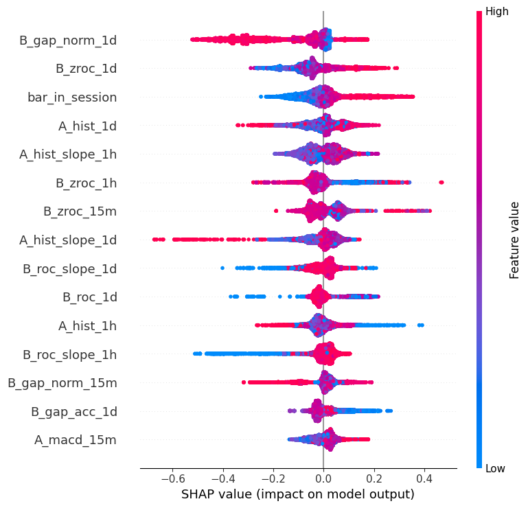
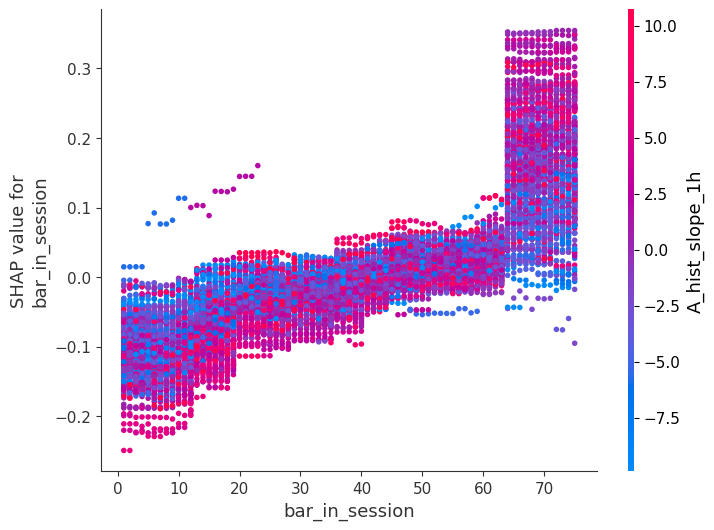

# Phase 5b — LightGBM Feature Importance (T5.5-T5.10)

## Walk-forward setup

- Train: bar_close in [2020-11-12 13:05:00+05:30, 2023-12-29 15:30:00+05:30], n=58,080
- Validation (hold-out): bar_close in [2024-01-01 09:20:00+05:30, 2024-12-31 15:30:00+05:30], n=18,495
- Target: y = (`ret_fwd_12` > 0)
- Train class balance: 31,049 / 58,080 positive (53.5%)
- Validation class balance: 9,549 / 18,495 positive (51.6%)
- Model: `LGBMClassifier(max_depth=4, n_estimators=200, learning_rate=0.05, random_state=42)`
- **Hold-out AUC (2024, in-sample-test only -- NOT the final OOS check, see Phase 6)**: 0.5089

## Permutation importance (top 15, scoring=roc_auc, n_repeats=10)

| feature          |   importance_mean |   importance_std |
|:-----------------|------------------:|-----------------:|
| bar_in_session   |          0.005205 |         0.001389 |
| A_hist_slope_1h  |          0.005076 |         0.001058 |
| A_macd_15m       |          0.003822 |         0.000727 |
| A_state_1h_ord   |          0.003217 |         0.000543 |
| A_hist_1h        |          0.003052 |         0.001357 |
| B_zroc           |          0.003031 |         0.000627 |
| B_roc_1h         |          0.002910 |         0.000460 |
| B_zroc_15m       |          0.002548 |         0.000531 |
| A_signal         |          0.002025 |         0.000233 |
| A_hist_slope_1d  |          0.001811 |         0.000868 |
| B_roc_15m        |          0.001522 |         0.000497 |
| A_hist           |          0.001079 |         0.000626 |
| B_roc_invalid_1d |          0.001013 |         0.000148 |
| B_roc_slope_1d   |          0.000976 |         0.000468 |
| B_gap_1h         |          0.000953 |         0.000424 |

_Full table: `reports/phase5/permutation_importance.csv`._

## SHAP summary

## SHAP dependence -- `bar_in_session` colored by `A_hist_slope_1h`

_corr(SHAP(bar_in_session), A_hist_slope_1h) = 0.002 -> little interaction: `bar_in_session`'s effect is largely independent of `A_hist_slope_1h`._

## Top splits of tree 0

| split_feature   |   threshold |       gain |   node_depth |   count |
|:----------------|------------:|-----------:|-------------:|--------:|
| A_macd_15m      |   -0.965851 | 196.108002 |            1 |   58080 |
| A_hist_slope_1h |   -0.673852 | 125.212997 |            2 |   34224 |
| B_roc_slope_1h  |   -3.714326 |  99.314903 |            2 |   23856 |
